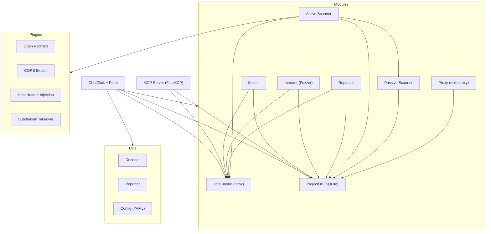

# justdastit

```
     ██╗██╗   ██╗███████╗████████╗██████╗  █████╗ ███████╗████████╗██╗████████╗
     ██║██║   ██║██╔════╝╚══██╔══╝██╔══██╗██╔══██╗██╔════╝╚══██╔══╝██║╚══██╔══╝
     ██║██║   ██║███████╗   ██║   ██║  ██║███████║███████╗   ██║   ██║   ██║
██   ██║██║   ██║╚════██║   ██║   ██║  ██║██╔══██║╚════██║   ██║   ██║   ██║
╚█████╔╝╚██████╔╝███████║   ██║   ██████╔╝██║  ██║███████║   ██║   ██║   ██║
 ╚════╝  ╚═════╝ ╚══════╝   ╚═╝   ╚═════╝ ╚═╝  ╚═╝╚══════╝   ╚═╝   ╚═╝   ╚═╝
```

**The Burp You Can Afford™** — Open-source CLI DAST toolkit that replaces Burp Suite Professional.

Python-powered. Async. CLI-native. AI-drivable via MCP.

[](https://www.python.org/downloads/)
[](https://opensource.org/licenses/MIT)
[](https://github.com/psf/black)

<!--  -->
<!-- asciicast: spider → fuzz → findings pipeline -->

---

## Why justdastit?

Burp Suite Professional costs $449/year. ZAP is powerful but bloated. Nuclei is template-only.

justdastit gives you Burp's core workflow — **spider → fuzz → scan → report** — entirely from your terminal. Every module works standalone or chains together. All data flows through a single SQLite database. And with MCP integration, Claude can drive it directly.

### Feature Comparison

| Feature | justdastit | Burp Pro ($449/yr) | ZAP | Nuclei |
|---|:---:|:---:|:---:|:---:|
| Intercepting Proxy | ✅ | ✅ | ✅ | ❌ |
| Spider/Crawler | ✅ | ✅ | ✅ | ❌ |
| Intruder/Fuzzer (4 modes) | ✅ | ✅ | ✅ | ❌ |
| Repeater | ✅ | ✅ | ✅ | ❌ |
| Passive Scanner | ✅ | ✅ | ✅ | ✅ |
| Active Scanner | ✅ | ✅ | ✅ | ✅ |
| Decoder/Encoder | ✅ | ✅ | ❌ | ❌ |
| Plugin System | ✅ | ✅ (BApps) | ✅ | ✅ (Templates) |
| HTML/MD/JSON Reports | ✅ | ✅ | ✅ | ✅ |
| CLI-First | ✅ | ❌ | ❌ | ✅ |
| MCP Server (AI-drivable) | ✅ | ❌ | ❌ | ❌ |
| Interactive Shell | ✅ | ❌ | ❌ | ❌ |
| YAML Config | ✅ | ✅ | ✅ | ✅ |
| Price | **Free** | $449/yr | Free | Free |

---

## Quick Start

```bash
# Install (core)
pip install justdastit

# Install with all features
pip install "justdastit[full]"

# Spider a target
justdastit spider https://target.com

# Fuzz parameters — auto-detects injection points
justdastit fuzz "https://target.com/search?q=test"

# Run passive scanner on captured traffic
justdastit scan

# Run active scanner (auto-attacks all endpoints)
justdastit scan --active

# View findings
justdastit findings

# Export HTML report
justdastit export -f html
```

Three commands to your first vulnerability report.

---

## Installation

```bash
# Minimal (httpx + click + rich)
pip install justdastit

# Full installation
pip install "justdastit[full]"

# Development
pip install -e ".[dev]"

# Individual extras
pip install "justdastit[proxy]"     # mitmproxy intercepting proxy
pip install "justdastit[reports]"   # Jinja2 HTML reports
pip install "justdastit[mcp]"       # MCP server for AI integration
pip install "justdastit[config]"    # YAML config file support
pip install "justdastit[shell]"     # Interactive REPL
```

Requires Python 3.10+.

---

## Command Reference

### `justdastit spider` — Web Crawler

Async crawler with scope control, form discovery, and link extraction.

```bash
# Basic crawl
justdastit spider https://target.com

# Deep crawl with more threads
justdastit spider https://target.com --depth 5 --threads 20

# Scoped crawl
justdastit spider https://target.com --scope "*.target.com"
```

### `justdastit fuzz` — Intruder/Fuzzer

Parameterized fuzzer with 4 attack modes. Auto-detects injection points from URL params, POST body (form + JSON), and cookies.

```bash
# Auto-detect and fuzz with XSS payloads (smart defaults)
justdastit fuzz "https://target.com/search?q=test"

# SQL injection testing
justdastit fuzz "https://target.com/search?q=test" -p sqli -t 20

# Fuzz POST form data
justdastit fuzz "https://target.com/login" -d "user=admin&pass=test" -p sqli

# Fuzz JSON API
justdastit fuzz "https://target.com/api" -X POST -d '{"q":"test"}' -p xss

# Path traversal with grep
justdastit fuzz "https://target.com/file?path=test" -p lfi --grep "root:"

# Custom wordlist
justdastit fuzz "https://target.com/search?q=test" -p /path/to/wordlist.txt

# Battering ram mode (same payload everywhere)
justdastit fuzz "https://target.com/search?q=test&lang=en" -a battering_ram -p ssti

# With auth
justdastit fuzz "https://target.com/api?id=1" -p sqli --auth "bearer eyJ..."
```

**Attack Modes:**
- `sniper` — One payload per position, one at a time (default)
- `battering_ram` — Same payload in all positions simultaneously
- `pitchfork` — Paired payloads across positions (1:1)
- `cluster_bomb` — All combinations of payloads × positions

**Built-in Payloads:** `sqli`, `xss`, `ssti`, `lfi`, `cmdi`

**Bundled Wordlists** (300+ payloads each): `sqli.txt`, `xss.txt`, `ssti.txt`, `lfi.txt`, `cmdi.txt`, `dirs.txt`, `params.txt`, `headers.txt`, `auth-bypass.txt`

### `justdastit scan` — Scanner

```bash
# Passive scan (analyzes captured traffic, no extra requests)
justdastit scan

# Active scan (auto-attacks all discovered injection points)
justdastit scan --active --threads 20
```

**Passive checks:** Missing security headers, CORS misconfig, cookie flags, server banner disclosure, sensitive data exposure (API keys, AWS creds, JWTs, GitHub tokens), SQL error disclosure, stack traces, debug endpoints, JWT algorithm issues, verbose error messages.

**Active checks:** Reflected XSS, error-based SQLi, blind SQLi (timing), SSTI, path traversal, command injection, open redirect. Plus passive scan on every response.

### `justdastit repeat` — Repeater

```bash
# Replay request from history
justdastit repeat 42

# With full response body
justdastit repeat 42 -v

# Modify headers and parameters
justdastit repeat 42 -m "H:X-Custom=test" -m "P:id=999"

# From raw HTTP request file
justdastit repeat --raw request.txt -v
```

### `justdastit proxy` — Intercepting Proxy

```bash
# Start on default port
justdastit proxy

# Custom port with scope
justdastit proxy --port 9090 --scope "*.target.com"
```

Requires mitmproxy: `pip install justdastit[proxy]`

### `justdastit decode` / `encode` / `hash` — Decoder

```bash
# Smart decode (auto-detects encoding)
justdastit decode "SGVsbG8gV29ybGQ="

# Specific decoder
justdastit decode "%3Cscript%3E" -t url
justdastit decode "eyJhbGciOiJIUzI1NiJ9.eyJ1c2VyIjoiYWRtaW4ifQ.sig" -t jwt

# Encode
justdastit encode "<script>alert(1)</script>" -t url
justdastit encode "Hello World" -t b64

# Hash
justdastit hash "password123"
justdastit hash "admin" -t md5
```

**Encoders:** `url`, `url-full`, `double-url`, `b64`, `b64url`, `html`, `hex`, `unicode`, `json`
**Decoders:** `url`, `b64`, `b64url`, `html`, `hex`, `unicode`, `json`, `jwt`
**Hashers:** `md5`, `sha1`, `sha256`, `sha512`

### `justdastit history` / `findings` / `sitemap` / `stats`

```bash
justdastit history              # Show request history
justdastit history -f "api"     # Filter by URL
justdastit findings             # Show all findings
justdastit findings -s high     # Filter by severity
justdastit sitemap              # Show discovered URLs
justdastit stats                # Show project statistics
```

### `justdastit export` — Report Generation

```bash
justdastit export               # Markdown report (default)
justdastit export -f html       # Self-contained HTML report
justdastit export -f json       # Machine-readable JSON
justdastit export -f html -o report.html
```

### `justdastit shell` — Interactive REPL

```bash
justdastit shell
```

Drops into a `msfconsole`-style REPL where you can browse history, repeat requests, run scans, decode data — all interactively.

### `justdastit init` — Config Generator

```bash
justdastit init                 # Creates justdastit.yaml in CWD
justdastit init -o myproject.yaml
```

---

## Configuration

Create `justdastit.yaml` in your project directory (or run `justdastit init`):

```yaml
project: target-name

scope:
  include: ["*.target.com"]
  exclude: ["logout", "delete"]

auth:
  type: bearer              # bearer | basic | header
  token: "eyJ..."

scanner:
  threads: 20
  timeout: 15
  delay_ms: 100
  user_agent: "Mozilla/5.0..."

proxy:
  port: 8080

database:
  path: "justdastit.db"
```

Auto-loaded from CWD if present. CLI flags always override config values.

---

## Architecture



### Key Principles

- **CLI-first, MCP-enabled** — primary interface is terminal, fully drivable by AI
- **Composable modules** — spider feeds active scanner, intruder results feed passive scanner, everything writes to the same DB
- **All HTTP through `HttpEngine`** — centralized auth, rate limiting, cookie jar, proxy routing
- **All persistence through `ProjectDB`** — single source of truth
- **Async everything** — `asyncio.run()` only at entry points
- **Graceful degradation** — mitmproxy, jinja2, fastmcp, pyyaml are optional

---

## MCP Server Integration

justdastit exposes itself as an MCP server so Claude (or any MCP client) can drive it directly.

### Claude Desktop Setup

Add to `claude_desktop_config.json`:

```json
{
  "mcpServers": {
    "justdastit": {
      "command": "justdastit",
      "args": ["mcp-server"],
      "env": {}
    }
  }
}
```

### Claude Code Setup

Add to `.claude/settings.json`:

```json
{
  "mcpServers": {
    "justdastit": {
      "command": "justdastit",
      "args": ["mcp-server"]
    }
  }
}
```

### Available MCP Tools

| Tool | Description |
|---|---|
| `spider` | Crawl a URL, discover pages and forms |
| `fuzz` | Fuzz URL parameters with payloads |
| `scan_passive` | Run passive scanner on captured traffic |
| `active_scan` | Run active scanner against all endpoints |
| `repeat_request` | Replay a request from history |
| `decode_data` | Decode data (auto-detect or specify type) |
| `encode_data` | Encode data with specified encoder |
| `hash_data` | Hash data with MD5/SHA1/SHA256/SHA512 |
| `get_findings` | Query findings from database |
| `get_history` | Browse captured request history |
| `get_sitemap` | Get discovered URL tree |

---

## Plugin Development

Create a Python file in `justdastit/plugins/`:

```python
from justdastit.plugins.base import ScanPlugin
from justdastit.core.models import Finding, HttpRequest, HttpResponse, Severity

class MyPlugin(ScanPlugin):
    name = "my_check"
    description = "Custom security check"
    author = "Your Name"

    def passive_check(self, req: HttpRequest, resp: HttpResponse) -> list[Finding]:
        findings = []
        # Analyze response for issues
        if "debug" in (resp.body or b"").decode("utf-8", errors="replace").lower():
            findings.append(Finding(
                title="Debug Information Found",
                severity=Severity.MEDIUM,
                url=req.url,
                detail="Response contains debug information.",
                cwe="CWE-215",
            ))
        return findings

    async def active_check(self, req: HttpRequest, engine) -> list[Finding]:
        # Send additional requests to test
        from justdastit.core.models import HttpRequest as HttpReq
        test_req = HttpReq(method="GET", url=req.url, headers={**req.headers, "X-Test": "value"})
        resp = await engine.send(test_req)
        # Analyze response...
        return []
```

Plugins are auto-discovered at scan time — drop the file in and it's active.

### Built-in Plugins

- **open_redirect** — Open redirect detection via parameter injection
- **cors_exploit** — Advanced CORS misconfiguration testing (origin reflection, null origin, subdomain bypass)
- **host_header_injection** — Host header attacks (X-Forwarded-Host, X-Original-URL, X-Rewrite-URL)
- **subdomain_takeover** — Dangling CNAME detection for 25+ providers

---

## Contributing

```bash
# Clone
git clone https://github.com/snailsploit/justdastit.git
cd justdastit

# Install dev dependencies
pip install -e ".[dev,full]"

# Run tests
pytest tests/ -v

# Format
black justdastit/ tests/

# Type check
mypy justdastit/
```

### Project Structure

```
justdastit/
├── justdastit/
│   ├── core/
│   │   ├── models.py          # Data types (HttpRequest, Finding, etc.)
│   │   ├── database.py        # SQLite project storage
│   │   └── engine.py          # Async HTTP client with auth + cookies
│   ├── modules/
│   │   ├── spider.py          # Async crawler
│   │   ├── intruder.py        # Fuzzing engine (4 attack modes)
│   │   ├── repeater.py        # Request replay
│   │   ├── scanner.py         # Passive security checks
│   │   ├── active_scanner.py  # Active vulnerability scanner
│   │   └── proxy.py           # Intercepting proxy (mitmproxy)
│   ├── utils/
│   │   ├── decoder.py         # Encode/decode/hash utilities
│   │   ├── reporter.py        # HTML/MD/JSON report generation
│   │   └── config.py          # YAML config loader
│   ├── plugins/               # Auto-discovered scan plugins
│   ├── wordlists/             # Production payload files
│   ├── templates/             # Jinja2 report templates
│   ├── cli.py                 # Click + Rich CLI
│   └── mcp_server.py          # FastMCP server
├── tests/                     # pytest test suite
├── pyproject.toml
└── README.md
```

---

## Roadmap

- [ ] Nuclei template compatibility layer
- [ ] WebSocket support
- [ ] GraphQL introspection + fuzzing
- [ ] Directory bruteforcing module
- [ ] Parameter mining/discovery
- [ ] Sequence/workflow recording
- [ ] AI-assisted vulnerability classification
- [ ] HTTP/2 support
- [ ] Burp state file import
- [ ] CI/CD pipeline integration (GitHub Actions)

---

## License

MIT — by [SnailSploit](https://snailsploit.com)

Built for the security community. Star the repo if it saves you $449/year.
